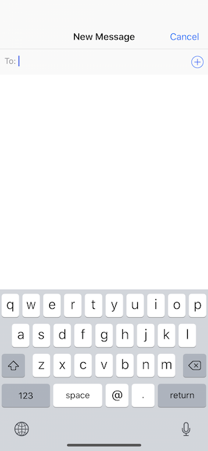

Presenting a `UIActivityViewController` from a `UIViewController` in a `UIWindow` at the `.normal` `UIWindowLevel` usually looks something like this:

Presenting a `UIActivityViewController` from a `UIViewController` in a `UIWindow` at the *`.alert`* `UIWindowLevel` looks something like this:
in iOS 11.1 and 11.2:

Using `UIWindowLevel`s such as `(.normal + 1)` seem to be fine but even `(.alert - 1)` break the message sharing view. 
